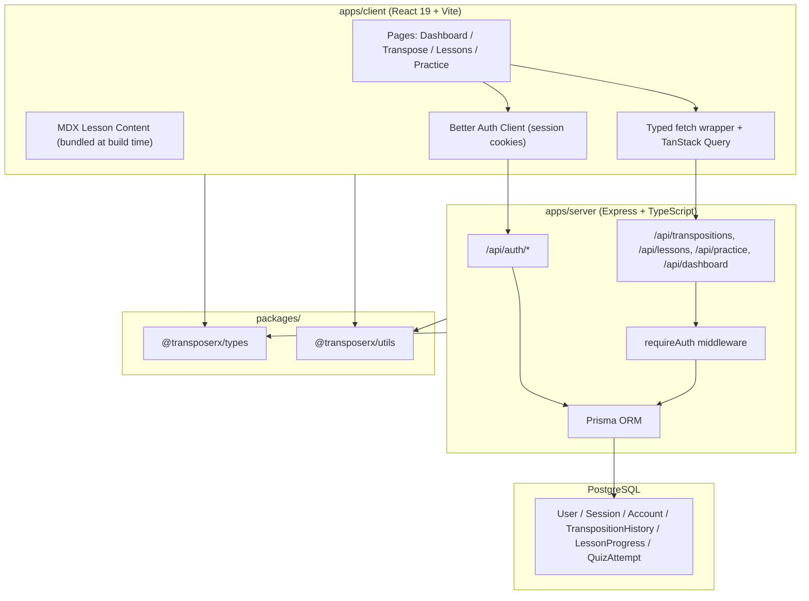

# Transpose Rx

Internal training tool built for ophthalmic technicians at a local eye clinic, combining an instant prescription transposer with a structured lesson library and practice mode.

---

## Key Features

- Instantly converts negative-cylinder prescriptions to positive format using the standard optometry transposition formula
- Per-eye transposition history saved per user, upserted on each submission
- MDX-based lesson library covering cylinder, axis, and transposition concepts
- Quiz and practice mode with personal best score tracking
- Dashboard summarizing lesson progress and recent transposition history
- Session-based authentication with email and password registration

---

## Architecture

---

## Tech Stack

---

## Testing

| Layer | Tool | Notes |
|---|---|---|
| Server integration | Vitest | Auth API tests run against a real test database; each suite truncates tables in `globalSetup` |
| Client unit | Vitest + React Testing Library | jsdom environment; component tests for pages and shared UI |
| E2E | Playwright (Chromium) | Isolated test database; global setup/teardown wipes state before each run |

A dedicated test Postgres service is defined in `docker-compose` so the test DB never touches production data. Server tests guard against `DATABASE_URL` pointing at the wrong DB before any writes.

---

## Design Decisions

**Session cookies over JWTs**
Better Auth manages sessions in the database, eliminating manual token refresh logic and making session revocation trivial.

**MDX content bundled with the client**
Lesson files live in `apps/client/content/` and are compiled by Vite at build time, keeping the server stateless for content. Adding a new lesson is a file addition rather than a database migration.

**Unique constraint + upsert for transposition history**
Rather than cleaning up old records in application code, a `@@unique([userId, eye])` constraint enforces one record per eye per user at the database level, keeping the history table lean and the logic simple.

**Shared packages for transpose logic and types**
Core transposition logic lives in `@transposerx/utils` (with unit tests) and is consumed by both client and server, ensuring consistent behavior across the stack without duplication.